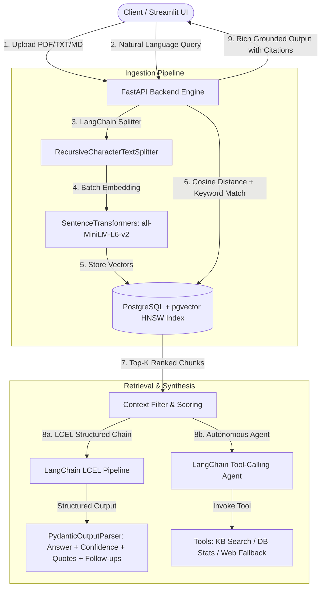

# Enterprise Hybrid-RAG Engine with PostgreSQL (pgvector), FastAPI & LangChain

[](https://www.python.org/)
[](https://fastapi.tiangolo.com/)
[](https://github.com/pgvector/pgvector)
[-1C3C3C.svg)](https://www.langchain.com/)
[](https://www.docker.com/)
[](https://streamlit.io/)
[](LICENSE)

A production-ready, containerized **Hybrid-RAG (Retrieval-Augmented Generation)** knowledge system built using **FastAPI**, **PostgreSQL (`pgvector`)**, **LangChain (LCEL & ReAct Tools)**, and **Streamlit**. Engineered with an emphasis on low-latency vector search, Pydantic structured output parsing, anti-hallucination prompt constraints, and autonomous tool calling.

---

## 🏗️ Architecture



---

## 🌟 Key Engineering Features

1. **Native PostgreSQL Vector Storage (`pgvector`)**:
   - Eliminates external vector database dependencies (Pinecone/Milvus).
   - Relational document metadata and 384-dimensional dense vectors live in the same ACID-compliant database.
   - Utilizes **HNSW (Hierarchical Navigable Small World)** indexing for sub-millisecond approximate nearest neighbor search.

2. **LangChain Text Splitting (`RecursiveCharacterTextSplitter`)**:
   - Boundary-aware recursive chunking prioritizing paragraphs, sentences, and word boundaries with sliding overlap (500 chars, 50 overlap).

3. **LCEL Declarative Pipeline with Pydantic Structured Output**:
   - Declarative chain: `ChatPromptTemplate | ChatModel | PydanticOutputParser`.
   - Returns verified grounding confidence score (0.0 to 1.0), verbatim citation quotes, and 3 intelligent follow-up questions.

4. **Agentic RAG Mode with LangChain Tools (`@tool`)**:
   - Equips the system with an autonomous tool-calling agent capable of routing queries between:
     - `search_knowledge_base`: Vector cosine retrieval against enterprise documents.
     - `get_document_stats`: Live metadata queries (document counts, chunk totals, indexed file list).
     - `web_search_fallback`: Dynamic internet search via DuckDuckGo for out-of-domain queries.
   - Captures and visualizes full step-by-step reasoning steps (`Thought -> Tool -> Output`).

5. **Hybrid Retrieval (Dense + Sparse Boost)**:
   - Combines dense semantic vector search (`<=>` cosine distance operator) with sparse lexical keyword boosting to prevent acronym and ID blind spots.

6. **Production Containerization**:
   - Multi-container orchestration with `docker-compose.yml` (Postgres, FastAPI, Streamlit).

---

## 📁 Project Structure

```text
enterprise-rag-engine/
├── docker-compose.yml           # Multi-container orchestration
├── .env.example                 # Environment variable template
├── .gitignore                   # Git ignore rules (keeps secrets & venvs safe)
├── README.md                    # Project overview & quickstart
├── ARCHITECTURE.md              # Technical architecture & design decisions
├── backend/
│   ├── Dockerfile
│   ├── requirements.txt         # FastAPI, LangChain, pgvector, PyPDF, etc.
│   └── src/
│       ├── main.py              # FastAPI app with lifespan startup
│       ├── config.py            # Pydantic settings
│       ├── db/
│       │   ├── session.py       # SQLAlchemy engine & pgvector initialization
│       │   └── models.py        # Document & DocumentChunk with HNSW Vector index
│       ├── services/
│       │   ├── chunking.py      # LangChain RecursiveCharacterTextSplitter
│       │   ├── embedding.py     # Singleton SentenceTransformers embedder
│       │   ├── retrieval.py     # Cosine distance vector & hybrid search
│       │   ├── generator.py     # Deterministic baseline synthesizer
│       │   ├── langchain_rag.py # LCEL Chain with Pydantic Structured Output
│       │   └── langchain_agent.py # LangChain Tools & ReAct Tool-Calling Agent
│       └── api/
│           ├── schemas.py       # Pydantic request/response models
│           └── routes.py        # Ingestion, Query, Structured, and Agent endpoints
└── frontend/
    ├── Dockerfile
    ├── requirements.txt
    └── app.py                   # Streamlit UI (Structured RAG, Agentic, & Direct modes)
```

---

## 🚀 Quickstart (One-Click Docker Setup)

### 1. Clone & Configure
```bash
git clone https://github.com/Ashish800935/enterprise-rag-engine.git
cd enterprise-rag-engine
cp .env.example .env
```

### 2. Launch with Docker Compose
```bash
docker compose up --build
```

The services will be live at:
* **Interactive Streamlit UI:** [http://localhost:8501](http://localhost:8501)
* **FastAPI Interactive Docs (Swagger):** [http://localhost:8000/docs](http://localhost:8000/docs)
* **PostgreSQL Database:** `localhost:5433` (`rag_db`)

---

## 🛠️ Local Development (Without Docker)

If you wish to run services directly on your host machine:

### 1. Start PostgreSQL with pgvector
```bash
docker run -d --name rag_postgres -p 5433:5432 -e POSTGRES_DB=rag_db -e POSTGRES_USER=postgres -e POSTGRES_PASSWORD=postgres_password pgvector/pgvector:pg16
```

### 2. Run FastAPI Backend
```bash
cd backend
python -m venv venv
# Windows: venv\Scripts\activate | Linux/macOS: source venv/bin/activate
pip install -r requirements.txt
uvicorn src.main:app --reload --port 8000
```

### 3. Run Streamlit Frontend
```bash
cd ../frontend
python -m venv venv
# Windows: venv\Scripts\activate | Linux/macOS: source venv/bin/activate
pip install -r requirements.txt
streamlit run app.py
```

---

## 📡 API Reference

### `POST /api/v1/documents/upload`
Uploads, parses (`.txt`, `.md`, `.pdf`), chunks via LangChain `RecursiveCharacterTextSplitter`, and embeds into PostgreSQL.

### `POST /api/v1/query/structured`
Executes LangChain LCEL chain and returns Pydantic structured output:
```json
{
  "query": "What are the revenue numbers in Q3?",
  "answer": "Q3 revenue reached $4.2 million, representing a 14% YoY increase.",
  "confidence_score": 0.94,
  "citations": [
    {
      "filename": "q3_report.pdf",
      "chunk_index": 2,
      "exact_quote": "Third-quarter consolidated revenue reached $4.2 million..."
    }
  ],
  "suggested_followups": [
    "What contributed to the 14% YoY increase?",
    "What were the corresponding Q3 operating expenses?",
    "What are the projected estimates for Q4?"
  ],
  "retrieval_latency_ms": 11.4,
  "total_latency_ms": 642.1
}
```

### `POST /api/v1/query/agent`
Executes LangChain Autonomous Agent with Tool Calling (`search_knowledge_base`, `get_document_stats`, `web_search_fallback`) and returns execution telemetry:
```json
{
  "query": "How many documents are uploaded and what are they?",
  "final_answer": "There are 2 documents uploaded: annual_report.pdf and policy.md.",
  "tools_used": ["get_document_stats"],
  "steps": [
    {
      "step_number": 1,
      "thought": "Detected query regarding knowledge base statistics. Selecting 'get_document_stats'.",
      "tool_name": "get_document_stats",
      "tool_input": "{}",
      "tool_output": "Total Ingested Documents: 2..."
    }
  ],
  "total_steps": 1,
  "latency_ms": 45.3
}
```

---

## 📖 Deep Dive & System Design
For an in-depth breakdown of architectural trade-offs, vector distance mathematics, HNSW indexing parameters, LCEL declarative design, and scaling strategies, see [ARCHITECTURE.md](ARCHITECTURE.md).

---

## 👨‍💻 Author
**Asheesh Kumar**
* GitHub: [@Ashish800935](https://github.com/Ashish800935)

---

## 📄 License
This project is licensed under the MIT License - see the [LICENSE](LICENSE) file for details.
