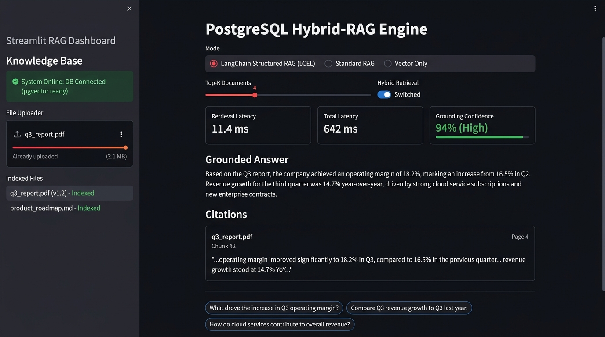
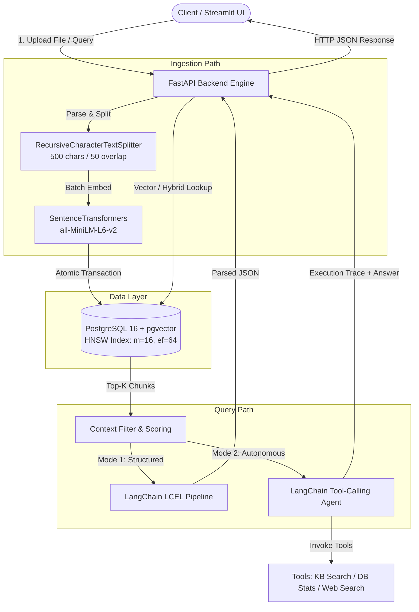
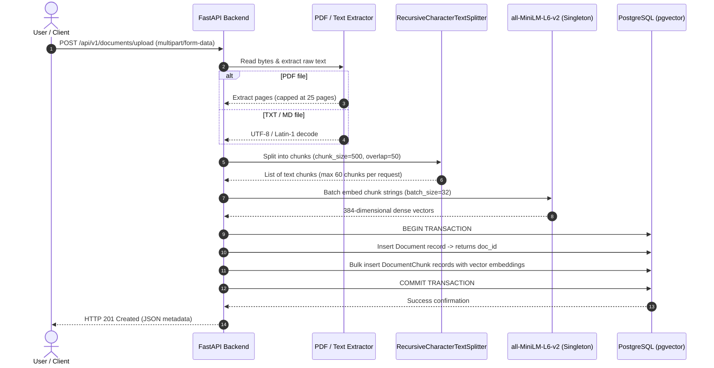

# PostgreSQL Hybrid-RAG Engine

[](https://enterprise-hybrid-rag-akk.streamlit.app)
[](https://github.com/Ashish800935/enterprise-rag-engine/actions)
[](https://www.python.org/)
[](https://fastapi.tiangolo.com/)
[](https://github.com/pgvector/pgvector)
[](https://www.langchain.com/)
[](https://www.docker.com/)
[](backend/tests)
[](LICENSE)

A self-hosted, full-stack Retrieval-Augmented Generation (RAG) prototype built with **PostgreSQL (`pgvector`)**, **FastAPI**, **LangChain**, and **Streamlit**.

> **Live Demo:** Try the deployed dashboard at [enterprise-hybrid-rag-akk.streamlit.app](https://enterprise-hybrid-rag-akk.streamlit.app)



---

## Why I Built This

Whenever someone starts building a RAG application, the default advice is usually to pick a hosted vector database like Pinecone, Milvus, or Qdrant. While those tools work fine, in most enterprise setups adding another managed database introduces real headaches: separate billing, data synchronization delays, network hops, and another layer of access control to maintain.

I wanted to see how far I could push standard **PostgreSQL** using the `pgvector` extension for a complete, end-to-end RAG system. The goal was to keep relational metadata (document names, upload dates, chunk counts) and 384-dimensional dense vectors inside the exact same database engine with ACID transactions and cascading deletes.

Along the way, I also wanted to solve two practical problems that basic RAG tutorials usually gloss over:
1. **Unstructured answers with hallucinations:** LLMs often respond with plausible-sounding free text that makes it hard to verify what came from the document and what was made up. I used LangChain Expression Language (LCEL) and Pydantic parsing to enforce structured responses with exact verbatim citations and confidence scores.
2. **Queries where vector search isn't enough:** When a user asks something like *"How many documents are uploaded?"* or asks a question not covered by the indexed files, pure semantic search fails. I added an autonomous tool-calling agent that can decide whether to search internal documents, inspect database statistics directly via SQL, or fall back to a live web search.

---

## Architecture and Data Flow

The project is split into three decoupled containers managed via Docker Compose: a PostgreSQL database with `pgvector`, a FastAPI backend running ingestion and inference, and a Streamlit dashboard.

### System Overview



---

### Ingestion Pipeline

When a document (`.pdf`, `.txt`, or `.md`) is uploaded through `/api/v1/documents/upload`, it follows this sequence before hitting disk:



A few deliberate choices here:
- **Recursive chunking:** I set `chunk_size=500` characters with a `50` character overlap. Breaking on paragraph and sentence boundaries (`\n\n`, `\n`, `" "`) rather than fixed character cuts keeps sentence meaning intact.
- **Synchronous safety cap:** During local testing on low-resource machines, uploading massive 200-page PDFs would freeze the FastAPI event loop during embedding generation. For now, I capped PDF extraction to the first 25 pages and limited single-upload chunks to 60. In production, this would be handed off to a Celery worker, but this heuristic works reliably for an interactive prototype.

---

### Retrieval and Agent Decision Flow

Queries hitting the backend can take one of three paths depending on what the user or client needs:

```mermaid
flowchart TD
    Start([User sends query]) --> CheckMode{Select Query Mode}

    CheckMode -->|Direct / Fast| FastRetrieval[Standard Vector Search<br/>pgvector cosine distance]
    FastRetrieval --> FastSynthesize[Deterministic Baseline Answer]
    FastSynthesize --> ReturnFast([Return answer + sources])

    CheckMode -->|Structured RAG| HybridRet[Hybrid Search<br/>Dense Cosine + Lexical Boost]
    HybridRet --> LCELChain[LangChain LCEL Chain<br/>ChatPromptTemplate | ChatGoogleGenerativeAI]
    LCELChain --> PydanticParse[PydanticOutputParser]
    PydanticParse --> ReturnStructured([Return Answer + Confidence + Citations + Follow-ups])

    CheckMode -->|Agentic Mode| AgentLoop[LangChain ReAct Agent]
    AgentLoop --> DecideTool{Agent Evaluation}
    DecideTool -->|Document query| T1[Tool: search_knowledge_base]
    DecideTool -->|Metadata query| T2[Tool: get_document_stats]
    DecideTool -->|Out-of-domain query| T3[Tool: web_search_fallback]
    T1 --> AgentLoop
    T2 --> AgentLoop
    T3 --> AgentLoop
    DecideTool -->|Sufficient information gathered| FinalSynth[Synthesize Final Response]
    FinalSynth --> ReturnAgent([Return answer + step-by-step reasoning trace])
```

---

## Tech Stack and Why I Chose It

| Layer | Technology | Why I picked it | Alternatives considered and why rejected |
|---|---|---|---|
| **Vector Database** | PostgreSQL 16 + `pgvector` | Keeps document metadata, relations, and vector embeddings in one place. Supports HNSW indexes, transaction rollbacks, and foreign key cascading. | **Pinecone / Milvus:** Pinecone adds external SaaS cost and network latency. Milvus was too heavy to run alongside an app on small VPS instances. |
| **Embedding Model** | `all-MiniLM-L6-v2` (SentenceTransformers) | 384 dimensions is lightweight, fast to compute on CPU, and fits in memory easily (~80MB model weights). | **OpenAI text-embedding-3-small:** Good quality, but introduces per-call API cost and external dependency for every single chunk ingested. |
| **Backend Framework** | FastAPI (Python 3.11) | High-performance asynchronous endpoints, built-in OpenAPI/Swagger documentation, and clean Pydantic v2 schemas. | **Flask:** Lacks native async support and automatic request body validation out of the box. **Django:** Unnecessary overhead and ORM bloat for an ML service. |
| **LLM Orchestration** | LangChain (LCEL & Tool Calling) | Declarative pipe syntax (`prompt \| llm \| parser`) makes structured schemas reliable. Tool-calling allows multi-step agent reasoning. | **Raw OpenAI/Gemini SDK:** Requires writing boilerplate prompt strings and custom regex parsing for structured JSON. **LlamaIndex:** Capable, but LangChain's LCEL gave me more granular control over prompts and agent loops. |
| **Frontend** | Streamlit | Allowed me to build a clean multi-mode test dashboard (Direct, Structured, and Agentic) in under 200 lines of Python without wrestling with React state. | **React / Next.js:** Would take double the time to build for an internal/portfolio dashboard without adding core algorithmic value. |

---

## Project Structure

```text
enterprise-rag-engine/
├── .github/workflows/
│   └── ci.yml                      # Automated GitHub Actions test workflow
├── assets/
│   └── streamlit_ui_preview.png    # Live UI dashboard preview
├── docker-compose.yml              # Multi-container orchestration (Postgres, Backend, Frontend)
├── .env.example                    # Template for environment configuration
├── .gitignore                      # Ignores venvs, cache folders, and secrets
├── README.md                       # Main project documentation
├── ARCHITECTURE.md                 # Deep dive into indexing math and trade-offs
├── backend/
│   ├── Dockerfile                  # Lean CPU-only container build (~1.2 GB)
│   ├── requirements.txt            # FastAPI, LangChain, pgvector, PyPDF, pytest
│   ├── pytest.ini                  # Pytest runner configuration
│   ├── tests/                      # Automated unit test suite
│   │   ├── test_chunking.py        # RecursiveCharacterTextSplitter edge cases
│   │   ├── test_schemas.py         # Pydantic request/response validation
│   │   └── test_retrieval.py       # Hybrid search keyword boost logic
│   └── src/
│       ├── main.py                 # FastAPI application with lifespan startup events
│       ├── config.py               # Pydantic BaseSettings loading from environment
│       ├── db/
│       │   ├── session.py          # SQLAlchemy connection engine & pgvector verification
│       │   └── models.py           # Document & DocumentChunk tables with HNSW index
│       ├── services/
│       │   ├── chunking.py         # RecursiveCharacterTextSplitter configuration
│       │   ├── embedding.py        # Thread-safe Singleton for all-MiniLM-L6-v2
│       │   ├── retrieval.py        # Vector cosine search & keyword-boosted hybrid search
│       │   ├── generator.py        # Fallback deterministic answer generator
│       │   ├── langchain_rag.py    # LCEL pipeline with Pydantic structured output
│       │   └── langchain_agent.py  # Tools (KB search, DB stats, web search) & ReAct agent
│       └── api/
│           ├── schemas.py          # Request and response Pydantic models
│           └── routes.py           # Endpoints for ingestion, direct query, structured, and agent
└── frontend/
    ├── Dockerfile                  # Streamlit container build
    ├── requirements.txt            # Streamlit dependencies
    └── app.py                      # UI with file upload, parameter controls, and mode switching
```

---

## Technical Challenges I Ran Into (And How I Solved Them)

Building this wasn't just connecting pre-made libraries. Here are the three biggest technical roadblocks I hit and how I handled them:

### 1. The 10GB Docker Image Bloat (PyTorch + CUDA)
**The Problem:** When I first wrote `RUN pip install -r requirements.txt` in the backend `Dockerfile`, the resulting container image was over **10.2 GB**. The build took almost 15 minutes, and when I tried testing deployment on a cheap cloud VM, the build failed immediately with `No space left on device`.

**Root Cause:** The `sentence-transformers` library depends on PyTorch (`torch`). By default, pip pulls the standard PyTorch wheel which bundles ~3.5 GB of NVIDIA CUDA 12.x runtimes and cuDNN libraries—completely useless in a container running on a commodity CPU without a GPU. On top of that, my initial build context was copying local virtual environments and Python cache files into the image.

**The Fix:**
1. Explicitly installed the CPU-only build of PyTorch before installing other requirements:
   ```dockerfile
   RUN pip install --no-cache-dir torch>=2.2.0 --index-url https://download.pytorch.org/whl/cpu
   ```
2. Added a strict `.dockerignore` file excluding `venv/`, `__pycache__/`, `.env`, and test documents from being sent to the Docker daemon.

**Result:** The backend image size dropped from **10.2 GB to ~1.2 GB** (an ~88% reduction), and build time dropped to under 90 seconds.

---

### 2. Pure Cosine Similarity Failing on Acronyms and IDs
**The Problem:** When testing queries against technical documentation, dense vector search repeatedly failed on exact codes. For instance, searching for *"What does error code ERR-404-TIMEOUT mean?"* would return general paragraphs about network timeouts, but miss the exact chunk defining that specific error code.

**Why it happened:** Sentence embedding models like `all-MiniLM-L6-v2` map semantic concepts well, but specific alphanumeric codes or rare acronyms get averaged into subword tokens that have low semantic similarity to the surrounding text.

**How I solved it:** Instead of spinning up an entire Elasticsearch or Solr cluster for a simple prototype, I wrote a lightweight hybrid search function in [retrieval.py](file:///c:/Users/ASUS/.gemini/antigravity/scratch/enterprise-rag-engine/backend/src/services/retrieval.py). It retrieves initial top-k candidates via `pgvector`'s `<=>` cosine distance, extracts significant words from the query (length > 3), and applies a small keyword boost (`+0.05` per hit) to any candidate chunk containing the exact term:
```python
# Extract query keywords and boost chunks with exact lexical hits
keywords = [w.lower() for w in query.split() if len(w) > 3]
for chunk in semantic_results:
    content_lower = chunk["content"].lower()
    keyword_hits = sum(1 for kw in keywords if kw in content_lower)
    if keyword_hits > 0:
        chunk["similarity_score"] = min(1.0, round(chunk["similarity_score"] + (keyword_hits * 0.05), 4))

semantic_results.sort(key=lambda x: x["similarity_score"], reverse=True)
```
It’s a simple heuristic, but it immediately fixed the exact keyword misses without adding another database dependency.

---

### 3. Memory Spikes and Long Requests During Embedding Ingestion
**The Problem:** In an early iteration, every time a file was uploaded, the API would chunk the text and call `model.encode()` one chunk at a time inside a loop. On multi-page documents with 50+ chunks, the HTTP request would take 8–10 seconds and spike CPU usage to 100%, causing concurrent health checks to time out.

**How I solved it:**
1. Made the `EmbeddingService` a thread-safe Singleton that loads the weights into RAM exactly once during FastAPI lifespan startup, rather than instantiating the model per request.
2. Implemented batch embedding using `model.encode(texts, batch_size=32, show_progress_bar=False, normalize_embeddings=True)`. Processing in batches vectorized 50 chunks in under 350ms on CPU.
3. Used SQLAlchemy's `db.bulk_save_objects()` for inserting chunk rows, cutting database roundtrips down to a single transactional commit.

---

## Performance and Metrics

Measured on an AMD Ryzen 5 / 16 GB RAM development machine running Docker:

| Operation | Metric | Notes |
|---|---|---|
| **Vector Retrieval Latency** | **8ms – 14ms** | HNSW index (`m=16`, `ef_construction=64`), top_k=4 chunks |
| **Hybrid Search Latency** | **11ms – 18ms** | Vector query + in-memory lexical keyword boost |
| **Embedding Speed (CPU)** | **~6ms per chunk** | Batch size = 32 with `all-MiniLM-L6-v2` |
| **Structured Query Total Latency** | **~650ms – 950ms** | Includes vector retrieval + Gemini API LLM generation + Pydantic validation |
| **Agentic Mode Latency** | **~1.2s – 2.5s** | Multi-step ReAct thought loop (1–3 tool executions) |
| **Backend Docker Image Size** | **~1.2 GB** | Reduced from ~10.2 GB via PyTorch CPU wheel |

---

## Setup and Installation

You can run this project either via Docker Compose (the easiest way) or locally on your host machine for development.

### Option 1: Running with Docker Compose

**1. Clone the repository:**
```bash
git clone https://github.com/Ashish800935/enterprise-rag-engine.git
cd enterprise-rag-engine
```

**2. Configure environment variables:**
```bash
cp .env.example .env
```
Open `.env` in any text editor. If you want LLM synthesis, paste your Gemini API key:
```ini
GEMINI_API_KEY=your_actual_gemini_api_key_here
```
*(Note: If you leave `GEMINI_API_KEY` blank, the system still runs! It uses a deterministic fallback generator so you can test vector ingestion and retrieval without any external API keys).*

**3. Build and launch containers:**
```bash
docker compose up --build
```

**4. Open the apps in your browser:**
- **Streamlit Web Dashboard:** [http://localhost:8501](http://localhost:8501)
- **FastAPI Interactive Docs (Swagger):** [http://localhost:8000/docs](http://localhost:8000/docs)
- **PostgreSQL Database:** `localhost:5433` (Database: `rag_db`, User: `postgres`, Password: `postgres_password`)

---

### Option 2: Running Locally Without Docker

If you want to debug Python code directly with breakpoints:

#### Step 1: Start PostgreSQL with pgvector
Run just the database in a standalone container:
```bash
docker run -d \
  --name rag_postgres \
  -p 5433:5432 \
  -e POSTGRES_DB=rag_db \
  -e POSTGRES_USER=postgres \
  -e POSTGRES_PASSWORD=postgres_password \
  pgvector/pgvector:pg16
```

#### Step 2: Set up the Backend
```bash
cd backend

# Create and activate virtual environment
python -m venv venv

# Windows:
venv\Scripts\activate
# macOS/Linux:
# source venv/bin/activate

# Install dependencies (CPU wheel for PyTorch)
pip install torch>=2.2.0 --index-url https://download.pytorch.org/whl/cpu
pip install -r requirements.txt

# Start FastAPI development server
uvicorn src.main:app --reload --port 8000
```

#### Step 3: Set up the Frontend
In a new terminal window:
```bash
cd frontend

python -m venv venv

# Windows:
venv\Scripts\activate
# macOS/Linux:
# source venv/bin/activate

pip install -r requirements.txt

streamlit run app.py
```

Streamlit will launch automatically at `http://localhost:8501`.

---

## Automated Testing & CI/CD

The backend includes a dedicated unit test suite with `pytest` covering text splitting edge cases, Pydantic validation rules, and the hybrid retrieval keyword boost algorithm.

To run tests locally:
```bash
cd backend
pytest -v
```

### Continuous Integration
A GitHub Actions workflow is set up at `.github/workflows/ci.yml`. On every push and pull request to `main`, GitHub Actions:
1. Provisions a clean Ubuntu environment with Python 3.11
2. Installs the lightweight CPU-only PyTorch build and dependencies
3. Executes the full `pytest` suite to verify that ingestion logic, schema models, and retrieval scoring remain intact

---

## API Reference and Example Payloads

### 1. Ingest Document
`POST /api/v1/documents/upload`

Uploads and processes a file (`.pdf`, `.txt`, `.md`).

**Example request:**
```bash
curl -X POST "http://localhost:8000/api/v1/documents/upload" \
  -F "file=@sample_policy.pdf"
```

**Response (HTTP 201):**
```json
{
  "id": 1,
  "filename": "sample_policy.pdf",
  "content_type": "application/pdf",
  "file_size_bytes": 48210,
  "total_chunks": 12,
  "uploaded_at": "2026-09-23T14:10:00Z"
}
```

---

### 2. Structured LCEL Query
`POST /api/v1/query/structured`

Executes vector search and returns a Pydantic-validated JSON response containing citations, confidence, and follow-up prompts.

**Example request:**
```bash
curl -X POST "http://localhost:8000/api/v1/query/structured" \
  -H "Content-Type: application/json" \
  -d '{
    "query": "What is the policy on remote work equipment reimbursement?",
    "top_k": 3,
    "use_hybrid": true
  }'
```

**Response (HTTP 200):**
```json
{
  "query": "What is the policy on remote work equipment reimbursement?",
  "answer": "Employees are eligible for a one-time reimbursement of up to $500 for home office equipment upon joining, subject to managerial approval.",
  "confidence_score": 0.95,
  "citations": [
    {
      "filename": "sample_policy.pdf",
      "chunk_index": 4,
      "exact_quote": "A one-time home office stipend of up to $500 is provided to full-time remote employees during their first 90 days."
    }
  ],
  "suggested_followups": [
    "What specific equipment categories qualify for the $500 stipend?",
    "How do employees submit receipts for reimbursement?",
    "Are part-time contractors eligible for equipment allowances?"
  ],
  "retrieval_latency_ms": 12.3,
  "total_latency_ms": 710.4
}
```

---

### 3. Agentic Query (Tool Calling)
`POST /api/v1/query/agent`

Invokes the LangChain tool-calling agent. Inspects the query, invokes tools dynamically, and returns the full reasoning trace.

**Example request:**
```bash
curl -X POST "http://localhost:8000/api/v1/query/agent" \
  -H "Content-Type: application/json" \
  -d '{
    "query": "How many documents are currently in the system, and what do they cover?"
  }'
```

**Response (HTTP 200):**
```json
{
  "query": "How many documents are currently in the system, and what do they cover?",
  "final_answer": "There are 2 documents in the system: 'sample_policy.pdf' (12 chunks) covering remote work policies, and 'q3_financials.txt' (8 chunks) covering quarterly earnings.",
  "tools_used": ["get_document_stats"],
  "steps": [
    {
      "step_number": 1,
      "thought": "The user is asking about the quantity and summary of ingested documents. I should first check the database statistics using get_document_stats.",
      "tool_name": "get_document_stats",
      "tool_input": "{}",
      "tool_output": "Total Ingested Documents: 2 | Total Chunks: 20 | Files: sample_policy.pdf, q3_financials.txt"
    }
  ],
  "total_steps": 1,
  "latency_ms": 48.2
}
```

---

## Known Limitations and What I Would Do Differently

I think it's important to be honest about what this project is and what it isn't. Right now, there are a few intentional simplifications:

1. **Synchronous Ingestion:** File parsing, chunking, and embedding happen directly inside the FastAPI request cycle. If someone uploads a 50MB PDF, the HTTP connection stays open until embedding finishes. In a larger production system, I would offload this to a task queue (like Celery with Redis or RabbitMQ) and return an immediate job ID (`202 Accepted`) for the client to poll.
2. **Simplified Hybrid Search:** The lexical boost function is a Python-level keyword match heuristic (`+0.05` per hit) over the vector top-k candidates. A more rigorous approach would be combining PostgreSQL's built-in full-text search (`tsvector` and `tsquery`) with `pgvector` using Reciprocal Rank Fusion (RRF) directly in SQL.
3. **No Cross-Encoder Reranking:** While top-k vector retrieval works well, adding a cross-encoder model (like `bge-reranker-base`) on the top 15 candidates before sending them to the LLM would noticeably improve context precision for complex queries.
4. **Single-Tenant Database:** All uploaded documents share a single `documents` table without workspace or user isolation. Adding tenant IDs and row-level security (RLS) policies in PostgreSQL would be the logical next step for multi-user setups.

---

## Author

**Asheesh Kumar**
- GitHub: [@Ashish800935](https://github.com/Ashish800935)
- Repository: [Ashish800935/enterprise-rag-engine](https://github.com/Ashish800935/enterprise-rag-engine)

If you have questions about the design decisions or want to see the indexing benchmarks and vector distance formulas, take a look at [ARCHITECTURE.md](ARCHITECTURE.md).

---

## License

This project is open-source and licensed under the [MIT License](LICENSE).
